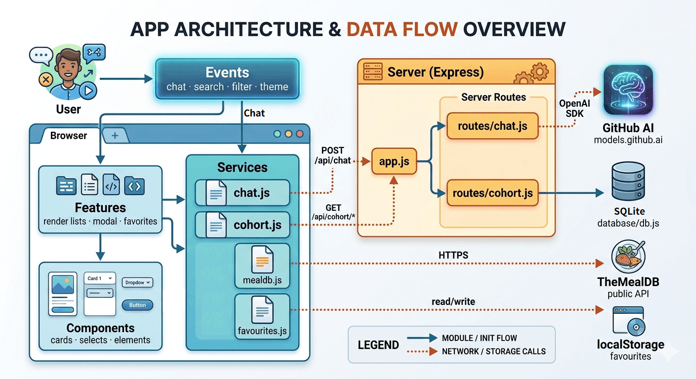
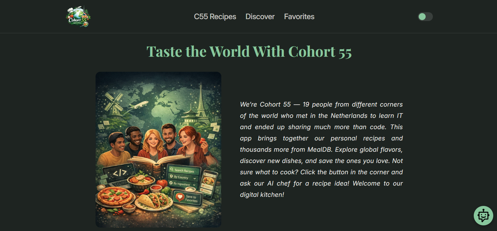
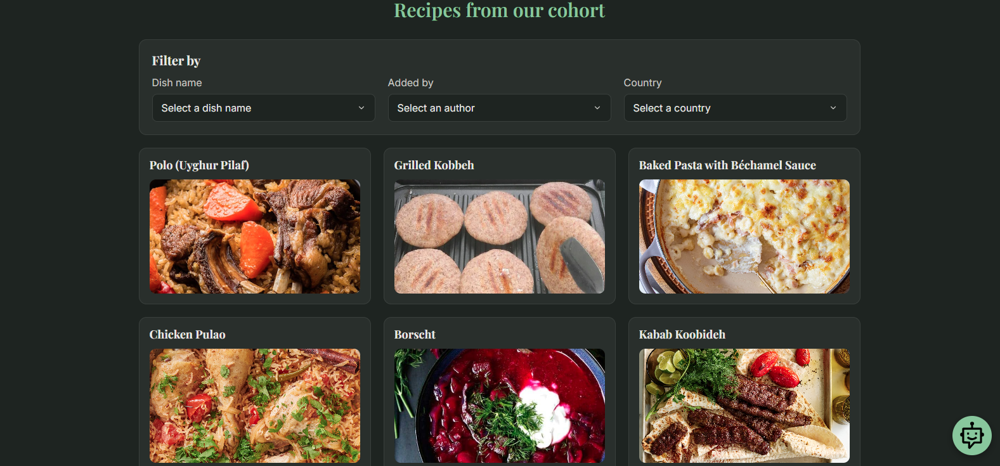
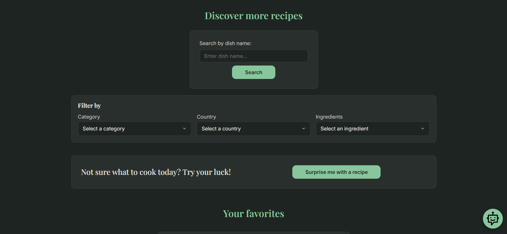
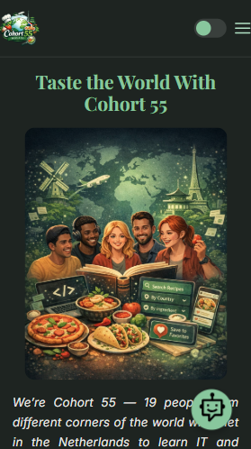

# Cookbook (A Recipe Web App)

**Cookbook** is a single-page recipe web app that brings together two worlds of cooking inspiration:

- **Global Recipes** — Explore thousands of authentic recipes from around the world using the *TheMealDB* public API.
- **Cohort Favorites** — Discover a curated collection of favorite dishes shared by **c55 cohort members**, with photos, country of origin, and step-by-step instructions stored in our own SQLite database.

With Cookbook, users can search, browse, save, and even get AI-generated recipe suggestions — all in one place.

***

### Application Overview

The app is a **single-page application** with four main sections:

- **Discover:** Browse and search recipes from *TheMealDB API*. Filter by category, country, or ingredient. Hit **Surprise me** for a random recipe pick.
- **C55 Recipes:** A hand-picked list of favorite dishes from c55 cohort members, each showing a photo, country of origin, and complete recipe. Filter by dish name, country, or who added it. Entries are stored in an **SQLite database**.
- **Saved:** A personal favorites list where users can save recipes from both sources by clicking the ⭐ Save button. Saved recipes are stored in **localStorage**.
- **AI Chat:** A floating chat assistant (bottom-right corner) powered by **GPT-4.1** via GitHub's model inference API. Ask it for recipe ideas and it returns a structured recipe with title and instructions.

The app also supports a **dark / light theme toggle**, with the preference saved in localStorage.

***

### Architecture

<div align="center">
  
</div>

***

### Screenshots

#### Desktop

<div align="center">
  
  
  
</div>

#### Mobile

<div align="center">
  
</div>

***

### Getting Started

**Requirements:** Node.js v18 or higher (the project was developed on v24).

1. Clone the repository
2. Run `npm install` to install dependencies
3. Create a `.env` file in the project root and add your GitHub token:
   ```
   GH_TOKEN=your_github_token_here
   ```
   The token needs access to [GitHub model inference](https://github.com/marketplace/models). Without it the AI chat feature will not work, but the rest of the app runs fine.
4. Run `npm start` to start the app

***

### Code Quality

- Run `npm run lint` to check for linting issues (ESLint)
- Run `npm run format` to format code using **Prettier**

***

### Testing

Run all tests with:
```
npm test
```

Uses **Vitest** as the test runner and **Supertest** for HTTP endpoint testing. The test suite covers:

- **`cohort.test.js`** — backend API endpoints (`/api/cohort/*`) via Supertest: fetching all recipes, filtering by area/title/contributor, and fetching by ID
- **`favourites.test.js`** — unit tests for the localStorage-based favourites service: save, remove, toggle, and duplicate prevention
- **`mealdb.test.js`** — unit tests for the TheMealDB service functions: search, filter, and data normalization

***

### CI Pipeline

Every pull request to `main` automatically runs two checks via GitHub Actions:

1. **Lint** — `npm run lint` (ESLint)
2. **Tests** — `npm test` (Vitest)

Both must pass before a PR can be merged. The workflow is defined in [`.github/workflows/ci.yaml`](.github/workflows/ci.yaml).

***

### CD / Deployment

The app is deployed on Render:
[https://c55-core-project-group-4-cookbook.onrender.com/](https://c55-core-project-group-4-cookbook.onrender.com/)

Because this project uses the **Render Free Tier**, the service can go to sleep when idle. On the first request after inactivity, it may take around **30-60 seconds** to wake up.

To reduce this delay, an external cron job is configured to periodically ping the app and help keep the service awake.

***

### Possible Future Improvements

These are ideas we considered but didn't implement within the project scope — natural next steps if the project were to grow:

- **Database upgrade** — Replace SQLite with **PostgreSQL** (relational, production-ready) or **MongoDB** (flexible schema). SQLite works well for a small static dataset like ours but doesn't scale well for concurrent writes or a growing recipe collection.

- **User authentication** — Add login/signup so users can have their own accounts. This would also allow moving saved favorites from **localStorage** (device-specific) to a database (synced across devices).

- **Admin panel for cohort recipes** — Currently cohort recipes are seeded via SQL. A simple authenticated admin UI would allow adding, editing, or removing dishes without touching the database directly.

- **Proper deployment** — Move off the **Render Free Tier** to a paid plan (or a different provider like Railway, Fly.io, or a VPS) to eliminate the cold-start delay and the need for a keep-alive cron job.

- **Rate limiting on the AI chat endpoint** — The `/api/chat` route is currently unprotected. Adding rate limiting (e.g. via `express-rate-limit`) would prevent abuse of the GitHub model inference quota.

- **Chat history / conversation context** — The AI chat currently sends only the latest message. Passing previous messages would allow multi-turn conversations (e.g. "make it vegetarian" as a follow-up).

- **Frontend bundling** — Currently Vite is used in dev mode only. Setting up a proper Vite production build would reduce asset size and improve load time in production.

***

### Team & Collaboration

Our project was a collaborative effort with clearly defined responsibilities across both frontend and backend development, as well as project coordination and quality assurance.

- **Diana Chukhrai** led the backend data layer and AI integration. She designed the SQLite database schema, implemented cohort API routes with filtering, wrote backend tests, and built the AI chat feature using GPT-4.1. She also contributed to the frontend by developing the chat UI, including the floating bubble, popup, and card rendering. She proactively reached out to everyone to establish the project idea and suggestion of division of responsibilities early, which we believe was essential for a strong project kickoff.

- **Hamed Razizadeh** focused on external API integration and user-centric features. He implemented TheMealDB API services and routes, developed the favorites functionality using localStorage, and handled UI rendering and modal integration for favorites. He also contributed comprehensive unit tests and implemented ingredient sorting.

- **Yana Pechenenko** was responsible for the entire frontend architecture and user experience. She built the HTML structure, configured Vite, and implemented all styling. Her work included cohort recipe rendering, search and filter interfaces, the recipe modal, the light/dark theme toggle, and mobile navigation. Yana did most of the heavy lifting on the frontend.


- **Yusup Rozimemet** set up the project structure based on discussions following the first standup meeting and configured the Express server, CI/CD pipelines, and Supertest integration following Jim’s suggestion. He maintained the README and actively supported team collaboration and communication, helping ensure smooth progress. He also contributed through code reviews, bug fixing, and constructive feedback to help prevent future issues. His main goal was to keep the project moving forward and avoid getting stuck.


- **Jim Cramer (Coach)** provided guidance and quality oversight throughout the project. He conducted code reviews, helped set up type checking, configured Prettier, and introduced Morgan middleware for improved logging. The team greatly appreciated his timely feedback and proactive support, which helped identify issues early and prevent larger problems later on.


***

### License

This project is open source and available under the [MIT License](LICENSE).
